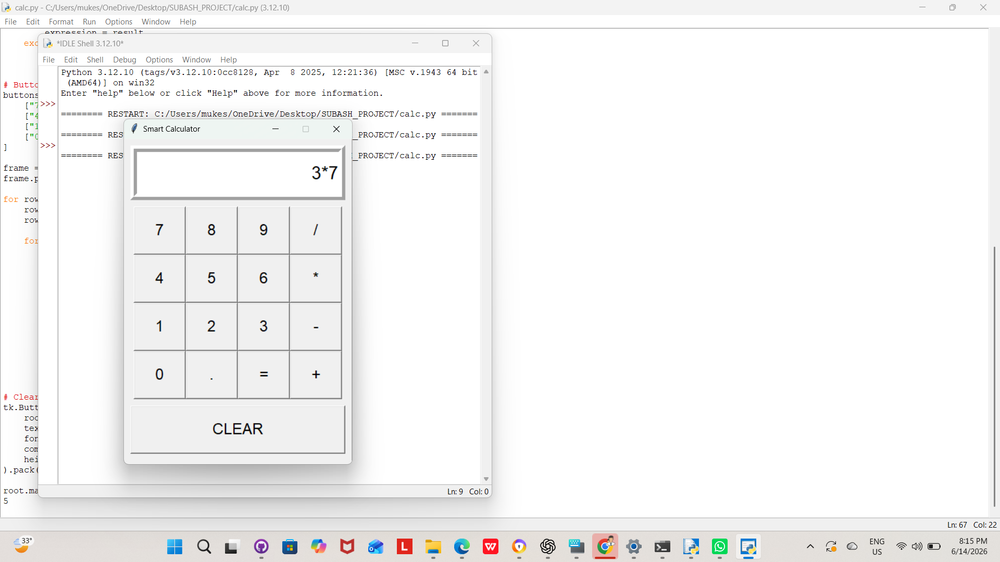

# Smart Calculator

A GUI-based Calculator developed using Python and Tkinter.

## Features

- Addition
- Subtraction
- Multiplication
- Division
- Clear Function
- User-Friendly Interface

## Output

## Author

SUBASH P

B.E Computer Science and Engineering (AI & ML)
